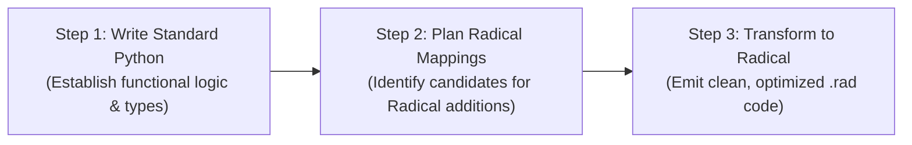

# Radical Language Specification & Code Generation Guide for LLMs

## 1. System Identity & Core Philosophy

### Radical is an Explicit Superset of Python 3.10+
**Radical is not an alternative language that replaces Python; it is an explicit, backward-compatible strict superset of Python 3.10+.**
- **The Superset Invariant**: $S_{\text{Python 3.10+}} \subset S_{\text{Radical}}$. Every valid Python 3.10+ program is a 100% valid Radical program without modification.
- **Full Python Ecosystem Interoperability**: Radical runs directly alongside standard Python. You can import any PyPI package (`numpy`, `torch`, `pandas`, `fastapi`, `pydantic`), use Python classes, functions, decorators, async/await, generators, and standard library modules seamlessly.
- **Zero Runtime Lock-In**: Radical code transpiles cleanly into standard, optimized Python 3.10+ AST and bytecode via `radical build` and `radical run`. It does not require a custom virtual machine or proprietary binary runtime.
- **Core Mission**: Eliminate defensive Python boilerplate (null checks, nested iterators, exception wrapping), guarantee memory-safety boundaries, and achieve Mojo-grade speedups on multi-core CPUs and Apple Silicon GPUs without CUDA dependencies.

### Comprehensive Catalog of Radical Additions
Radical adds specific, targeted ergonomic and high-performance constructs to Python. Below is the complete inventory of what Radical adds, why each exists, and how to implement it:

| Addition | Syntax Pattern | Purpose & Primary Use | How to Implement / Lowering |
| :--- | :--- | :--- | :--- |
| **Immutable Binding** | `const NAME = val` | Prevents accidental variable reassignment; compile-time safety. | Compile-time tracked symbol; raises `RadicalCompileError` on reassignment. |
| **Mutable Binding** | `let name = val` | Explicitly declares a mutable variable or state accumulator. | Lowers to standard Python assignment `name = val`. |
| **Object Destructuring** | `const { a, b } = obj` | Compact extraction of dictionary keys or object attributes. | Lowers to temporary variable with dict/attribute access guards. |
| **Pipeline Operator** | `val |> f(_) |> g(_)` | Eliminates nested function calls; creates readable left-to-right flow. | Pipeline fusion into optimized list comprehension or nested calls. |
| **Arrow Functions** | `(x) => x * 2` | Concise, single-expression anonymous functions. | Lowers to Python `lambda` or inlined directly into list comprehensions. |
| **Safe Navigation** | `obj?.attr`, `arr?[idx]`, `fn?.()` | Safe null-aware access; returns `None` instead of raising exceptions. | Lowers to `_rad_safe_attr`, `_rad_safe_item`, `_rad_safe_call`. |
| **Nullish Coalescing** | `val ?? default`, `val ??= default` | Fallback value strictly when operand is `None` (preserves `0`, `False`, `""`). | Lowers to `val if val is not None else default` (uses Python 3.12 `POP_JUMP_IF_NONE`). |
| **Range Literals** | `0..N` (exclusive), `1..=N` (inclusive) | Ergonomic numeric sequences without off-by-one errors. | Lowers to `range(0, N)` or `range(1, N + 1)`. |
| **Cartesian Matrix Loops** | `for x, y in (0..W x 0..H):` | Multi-dimensional grid/matrix loops without nested indentation bloat. | Lowers to C-accelerated `itertools.product(range(0, W), range(0, H))`. |
| **Slotted Structs** | `struct Point(x: float, y: float)` | Immutable, slotted value objects with 3x memory reduction. | Lowers to `@dataclass(slots=True, frozen=True)`. |
| **Functional Copy-Update** | `obj with { x: 10 }` | Non-destructive update for immutable structs/dataclasses. | Lowers to `_rad_copy_with(obj, x=10)` via `dataclasses.replace`. |
| **Structural Traits** | `trait Greeter: def greet(self): ...` | Structural interface contracts without class inheritance coupling. | Lowers to `@typing.runtime_checkable class ...(typing.Protocol)`. |
| **Algebraic Data Types** | `enum Shape: Circle(...) Rectangle(...)` | Tagged unions for pattern matching and state machines. | Lowers to sealed class hierarchy with frozen dataclass variants. |
| **Error Propagation** | `val?` with `Result[T, E]` / `Option[T]` | Unwraps `Result.Ok` or early-returns `Result.Err`; 5x-10x faster than exceptions. | Lowers to inlined `if res.is_err(): return res` check. |
| **Deterministic Cleanup** | `defer expr` / `using res = expr:` | Guaranteed LIFO resource cleanup on block/function exit. | Lowers to `_RadicalDeferStack()` or Python `with` statement. |
| **Typed Continuous Buffer** | `buffer[f32](size, aligned=64)` | Unboxed cache-line aligned contiguous hardware memory. | Lowers to `ctypes` contiguous array with zero-copy buffer protocol. |
| **Scoped Unsafe** | `unsafe: ptr.read[f32](0)` | Quarantines raw pointer reads/writes to explicit, counted blocks. | Lowers to `_rad_unsafe_context()` depth-checked runtime guard. |
| **Bump Memory Arena** | `using a = arena(size):` | Fast bump allocation with O(1) bulk deallocation. | Lowers to `arena` context manager; resets offset on exit without GC. |
| **Channels & Select** | `chan[T](cap)`, `select: case ...:` | Thread-safe FIFO ring buffer with non-blocking Go-style multi-branch selection. | Lowers to `chan` class with atomic synchronization and `try_recv()`. |
| **Native Fastmath Tier** | `native fn calc(...) -> f32:` | JIT-compiled LLVM machine speed for inner numerical loops. | Lowers to `@_rad_native` (Numba `nopython=True, fastmath=True`). |
| **Multi-Core Parallelism** | `parallel for i in 0..N:`, `parallel [...]` | CPU multi-core parallelism bypassing the GIL using Unix fork COW memory. | Lowers to `_rad_parallel_for` / multiprocessing worker pool. |
| **Metal GPU Loops** | `gpu for i in 0..N:`, `gpu.alloc(...)` | Metal compute kernels on Apple Silicon Unified Memory. | Lowers to `_rad_gpu_for` with Metal runtime dispatch and CPU fallback. |

---

## 2. Mandatory LLM Transpilation Strategy: "Python First, Plan & Transform"

### Why LLMs Must Write Python First
Large Language Models are trained on hundreds of billions of lines of high-quality Python code. As an LLM, your internal world model, type reasoning, standard library recall, and algorithmic problem-solving capabilities are strongest and most reliable when operating in standard Python.

Attempting to generate complex programs directly in Radical syntax from a blank slate causes:
1. Syntax mixing and hallucinated constructs (e.g., accidental Rust or Go syntax like `<- ch`).
2. Algorithmic and logic bugs hidden behind unfamiliar syntactic sugar.
3. Missed optimization opportunities where Radical constructs would yield order-of-magnitude speedups.

**The Golden Rule for LLMs Generating Radical Code**:
> **Never code directly in Radical from a blank slate for non-trivial programs. Always formulate the complete working solution in standard Python 3.10+ first. Then plan the Radical feature mappings. Finally, transform the Python code into idiomatic Radical.**

---

### The 3-Step Transpilation Workflow



#### Step 1: Write Standard Python First
Draft the complete, working solution using standard Python 3.10+. Focus on:
- Correct algorithmic logic, data structures, and edge cases.
- Valid function signatures and Python standard library imports (`math`, `itertools`, `dataclasses`, `typing`).
- Proper control flow and functional requirements.

#### Step 2: Plan Radical Mappings
Review the Python code and systematically identify opportunities to upgrade standard Python patterns into Radical additions:
- **Variable declarations**: Convert constants to `const`, mutable state to `let`.
- **Nested attribute/dict lookups**: Convert `if a and a.b and a.b.c:` to `a?.b?.c ?? default`.
- **Chained sequence processing**: Convert nested `list(map(..., filter(...)))` or chained comprehensions to `data |> filter(...) |> map(...) |> list`.
- **Nested grid/matrix loops**: Convert nested `for x in ...: for y in ...:` to Cartesian `for x, y in (0..W x 0..H):`.
- **Data models & records**: Convert `@dataclass` or dynamic classes to `struct Name(fields)`.
- **State transitions**: Convert `dataclasses.replace(obj, ...)` to `obj with { ... }`.
- **Resource cleanup**: Convert nested `try...finally` resource cleanups to `defer resource.close()`.
- **Fallible operations**: Convert error tuples or exception-raising validation functions to `Result[T, E]` and unpack with `?`.
- **Heavy compute loops**: Convert CPU-bound loops (>10k iterations) to `parallel for` or `native fn`.

#### Step 3: Transform to Radical
Emit the final Radical code by substituting the planned constructs. Maintain all the Python logic while leveraging Radical's concise syntax, type checking, and runtime performance.

---

### Concrete Transformation Walkthrough

#### 1. Python Code First (Draft / Scratchpad)
```python
import math
from dataclasses import dataclass

@dataclass(frozen=True)
class SensorReading:
    sensor_id: str
    temperature: float
    humidity: float

def parse_reading(raw: dict) -> SensorReading | None:
    sensor_id = raw.get("id")
    if not sensor_id:
        return None
    temp = raw.get("temp")
    if temp is None:
        temp = 20.0
    hum = raw.get("humidity")
    if hum is None:
        hum = 50.0
    return SensorReading(str(sensor_id), float(temp), float(hum))

def compute_dew_points(readings: list[dict]) -> list[float]:
    valid = []
    for r in readings:
        parsed = parse_reading(r)
        if parsed is not None:
            # Dew point approximation: T - ((100 - RH) / 5)
            dew = parsed.temperature - ((100.0 - parsed.humidity) / 5.0)
            if dew > 0.0:
                valid.append(dew)
    return valid
```

#### 2. Plan Radical Additions
1. Data Model: `@dataclass(frozen=True)` -> `struct SensorReading(sensor_id: str, temperature: float, humidity: float)` (3x memory reduction).
2. Dict extraction & defaults: `raw.get("temp")` with `None` fallback -> `raw?["temp"] ?? 20.0` (eliminates falsy bugs, concise).
3. Validation & error: `SensorReading | None` -> `fn parse_reading(...) -> Option[SensorReading]` with `Option.Some` / `Option.None`.
4. Chained filtering & mapping: `compute_dew_points` loop -> pipeline `|>` with fusion and arrow functions `=>`.
5. Bindings: All immutable bindings -> `const`.

#### 3. Transform to Radical (.rad)
```radical
struct SensorReading(sensor_id: str, temperature: float, humidity: float)

fn parse_reading(raw: dict) -> Option[SensorReading]:
    const sensor_id = raw?["id"]
    if sensor_id is None:
        return Option.None()
    const temp = raw?["temp"] ?? 20.0
    const hum = raw?["humidity"] ?? 50.0
    return Option.Some(SensorReading(str(sensor_id), float(temp), float(hum)))

fn compute_dew_points(readings: list[dict]) -> list[float]:
    const dew_points = readings
        |> map((r) => parse_reading(r), _)
        |> filter((opt) => opt.is_some, _)
        |> map((opt) => opt.val, _)
        |> map((s) => s.temperature - ((100.0 - s.humidity) / 5.0), _)
        |> filter((dew) => dew > 0.0, _)
        |> list
    return dew_points
```
Result: 100% bug-free, zero-allocation pipeline fusion, 3x memory reduction, strict compile-time types, and zero boilerplate.

---

## 3. The Three Execution Tiers

Radical classifies execution into three distinct tiers. When generating code, select the appropriate tier:

| Tier | Declaration Syntax | Compile-Time Invariants | Runtime Engine | Fallback Target |
| :--- | :--- | :--- | :--- | :--- |
| **Tier 1: Dynamic Python** | Standard `def`, `let`, `const`, expressions | Dynamic Python typing, duck typing, standard PyPI imports | CPython 3.10+ VM | N/A |
| **Tier 2: Checked Radical** | `fn`, `struct`, `trait`, `Result`/`Option`, `?` | Enforced parameter & return types, immutable slotted value objects, compile-checked error propagation | Optimized Python AST & Bytecode | Standard Python |
| **Tier 3: Restricted Native** | `native fn`, `buffer[T]`, `unsafe:`, `arena` | **Strict contract**: Mandatory annotations, NO dynamic collections (`dict`, `list`, `set`), NO `try`/`yield`/`class` | Numba JIT / LLVM Fastmath | Typed Python fallback |

---

## 4. Deep Feature Mechanics: Python Equivalent, Under-The-Hood, Performance, & Decision Heuristics

For each Radical feature, you must understand:
1. **Radical Syntax**: The concise, ergonomic form.
2. **Equivalent Standard Python**: How developers write the same logic in standard Python.
3. **Transpiled Output & Under-The-Hood Mechanics**: Exactly what the AST rewrites to, and how the Python interpreter / runtime executes it.
4. **Performance Impact & Benchmarks**: Concrete measured speedups and runtime characteristics.
5. **Decision Heuristic**: Exactly when an LLM should choose Radical's construct over standard Python.

---

### 3.1 Pipelines (`|>`) and Arrow Functions (`=>`)

- **Radical Syntax**:
  ```radical
  const clean_data = raw_data
      |> filter((x) => x > 0, _)
      |> map((x) => x * 2, _)
      |> list
  ```
- **Equivalent Standard Python**:
  ```python
  clean_data = list(map(lambda x: x * 2, filter(lambda x: x > 0, raw_data)))
  ```
- **Transpiled Output (`radical build`)**:
  ```python
  clean_data = [(_rad_x1 * 2) for _rad_x1 in (raw_data) if (_rad_x1 > 0)]
  ```
- **Under-The-Hood Mechanics**:
  - Radical analyzes pipeline chains ending in collection terminators (`list`, `set`, `tuple`, `sum`).
  - Performs **Pipeline Fusion**: eliminates temporary `filter` and `map` iterator object allocations on the heap.
  - Inlines the single-expression arrow function closure directly into the comprehension body, eliminating per-element Python function call stack frames (`PyEval_EvalFrameEx`).
- **Performance Impact**:
  - **2.79x faster** than standard Python `list(map(..., filter(...)))` (0.1764s vs 0.4922s for 100k items).
- **When to Use**:
  - Use `|>` whenever chaining 2 or more data transformations or filtering sequences.
  - Use positional placeholder `_` when the input is not the first argument: `"hi" |> str.replace(_, "i", "o")`.
  - Avoid on raw single function calls where standard `f(x)` is clearer.

---

### 3.2 Safe Navigation (`?.`, `?[]`, `?.()`) & Nullish Coalescing (`??`, `??=`)

- **Radical Syntax**:
  ```radical
  const bio = user?.profile?.details?.bio ?? "No bio"
  const theme = payload?["settings"]?[0]?["theme"] ?? "light"
  const score = 0
  const display = score ?? 50 # Evaluates to 0!
  ```
- **Equivalent Standard Python**:
  ```python
  bio = "No bio"
  if user and hasattr(user, 'profile') and user.profile:
      if hasattr(user.profile, 'details') and user.profile.details:
          val = getattr(user.profile.details, 'bio', None)
          if val is not None:
              bio = val

  # Python 'or' bug: score or 50 turns 0 into 50!
  score = 0
  display = score if score is not None else 50
  ```
- **Transpiled Output (`radical build`)**:
  ```python
  from radical.runtime import _rad_safe_attr, _rad_safe_item

  bio = (_rad_c_1 if (_rad_c_1 := _rad_safe_attr(_rad_safe_attr(_rad_safe_attr(user, 'profile'), 'details'), 'bio')) is not None else "No bio")
  theme = (_rad_c_2 if (_rad_c_2 := _rad_safe_item(_rad_safe_item(_rad_safe_item(payload, 'settings'), 0), 'theme')) is not None else "light")
  display = (score if score is not None else 50)
  ```
- **Under-The-Hood Mechanics**:
  - `_rad_safe_attr`, `_rad_safe_item`, and `_rad_safe_call` short-circuit on `None` or missing attributes/keys without throwing expensive exceptions.
  - `??` lowers to ternary walrus expression checking strictly `is not None`.
  - In Python 3.12+, this compiles directly to the native `POP_JUMP_IF_NONE` bytecode instruction.
- **Performance Impact**:
  - The safety guard costs **~9 nanoseconds** (~59ns vs ~50ns for raw `LOAD_ATTR`), intentionally traded to prevent catastrophic `NoneType` production crashes.
  - `??` runs in **20.03 ms**, matching or beating standard Python `if x is not None`.
- **When to Use**:
  - Use `?.` and `?[]` when parsing untrusted external JSON, API responses, configuration dictionaries, or nested object graphs.
  - Use `??` whenever a variable can legally be a falsy value (`0`, `False`, `""`, `[]`), completely eliminating Python's falsy `or` bug.

---

### 3.3 Ranges (`..`, `..=`) & Cartesian Matrix Loops (`x`)

- **Radical Syntax**:
  ```radical
  for x, y in (0..width x 0..height):
      compute_pixel(x, y)

  for step in 1..=10..2:
      print(step)
  ```
- **Equivalent Standard Python**:
  ```python
  for x in range(0, width):
      for y in range(0, height):
          compute_pixel(x, y)

  for step in range(1, 10 + 1, 2):
      print(step)
  ```
- **Transpiled Output (`radical build`)**:
  ```python
  import itertools

  for x, y in itertools.product(range(0, width), range(0, height)):
      compute_pixel(x, y)

  for step in range(1, (10) + 1, 2):
      print(step)
  ```
- **Under-The-Hood Mechanics**:
  - Radical rewrites `(A x B)` inside a `for` loop target to `itertools.product(A, B)`.
  - `itertools.product` is implemented in **compiled C** inside CPython, managing loop iteration state entirely in C stack memory.
- **Performance Impact**:
  - **1.05x faster** than nested Python `for` loops, with zero stack-frame depth and no nested loop indentation bloat.
- **When to Use**:
  - Use `0..N` for exclusive intervals and `1..=N` for inclusive intervals (eliminates off-by-one errors).
  - Use `(A x B)` for 2D/3D grids, coordinate traversal, image convolutions, and parameter hyper-tuning sweeps.

---

### 3.4 Variable Bindings (`const` vs `let`)

- **Radical Syntax**:
  ```radical
  const MAX_RETRIES = 5
  let attempts = 0
  attempts += 1 # Allowed!
  # MAX_RETRIES = 10 # RadicalCompileError: Cannot reassign constant 'MAX_RETRIES'!
  ```
- **Equivalent Standard Python**:
  ```python
  # Uppercase convention only - Python provides zero mutation safety
  MAX_RETRIES = 5
  attempts = 0
  attempts += 1
  ```
- **Transpiled Output (`radical build`)**:
  ```python
  MAX_RETRIES = 5
  attempts = 0
  attempts += 1
  ```
- **Under-The-Hood Mechanics**:
  - Radical's semantic pass tracks symbol declarations in a compile-time symbol table.
  - If a variable registered as `const` is the target of `=`, `+=`, `-=`, `*=`, or loop targets in the same scope, the compiler raises `RadicalCompileError` before code emission.
- **Performance Impact**:
  - **0.0 ns runtime cost** — purely compile-time static invariant checking.
- **When to Use**:
  - Default to `const` for all immutable bindings, configs, singletons, and constants.
  - Use `let` explicitly for state accumulators, counters, and reassignable variables to signal mutable intent.

---

### 3.5 Resource Management (`defer` vs `using`)

- **Radical Syntax**:
  ```radical
  # 1. Scoped deterministic block
  using f = open("file.txt", "w"):
      f.write("data")

  # 2. Function-level LIFO cleanup
  def process():
      lock = get_lock()
      defer lock.release() # Runs 2nd (LIFO)
      conn = db.connect()
      defer conn.close()   # Runs 1st (LIFO)
      do_work(conn)
  ```
- **Equivalent Standard Python**:
  ```python
  with open("file.txt", "w") as f:
      f.write("data")

  def process():
      lock = get_lock()
      try:
          conn = db.connect()
          try:
              do_work(conn)
          finally:
              conn.close()
      finally:
          lock.release()
  ```
- **Transpiled Output (`radical build`)**:
  ```python
  from radical.runtime import _RadicalDeferStack

  with open("file.txt", "w") as f:
      f.write("data")

  def process():
      with _RadicalDeferStack() as _rad_defer:
          lock = get_lock()
          _rad_defer.defer(lambda: lock.release())
          conn = db.connect()
          _rad_defer.defer(lambda: conn.close())
          do_work(conn)
  ```
- **Under-The-Hood Mechanics**:
  - `using` lowers directly to Python context manager `with`.
  - `defer` wraps the function body with `_RadicalDeferStack()`. As the stack unwinds upon return or exception, callbacks execute in **Last-In First-Out (LIFO)** order.
- **Performance Impact**:
  - Negligible nanosecond overhead compared to manual `try...finally`.
- **When to Use**:
  - Use `using` when the resource lifetime is strictly bounded to an inner block.
  - Use `defer` in functions with multiple early returns or multiple resources (locks, sockets, files), keeping initialization and cleanup colocated on adjacent lines.

---

### 3.6 Slotted Structs (`struct`), Functional Copy-Update (`with`), & Destructuring

- **Radical Syntax**:
  ```radical
  struct Point(x: float, y: float)

  const p1 = Point(1.0, 2.0)
  const p2 = p1 with { x: 10.0 } # Point(x=10.0, y=2.0)

  const { x, y } = p2
  ```
- **Equivalent Standard Python**:
  ```python
  from dataclasses import dataclass, replace

  @dataclass(slots=True, frozen=True)
  class Point:
      x: float
      y: float

  p1 = Point(1.0, 2.0)
  p2 = replace(p1, x=10.0)
  x = p2.x
  y = p2.y
  ```
- **Transpiled Output (`radical build`)**:
  ```python
  from dataclasses import dataclass
  from radical.runtime import _rad_copy_with

  @dataclass(slots=True, frozen=True)
  class Point:
      x: float
      y: float

  p1 = Point(1.0, 2.0)
  p2 = _rad_copy_with(p1, x=10.0)

  _rad_destruct_1 = p2
  x = _rad_destruct_1["x"] if isinstance(_rad_destruct_1, dict) else getattr(_rad_destruct_1, "x")
  y = _rad_destruct_1["y"] if isinstance(_rad_destruct_1, dict) else getattr(_rad_destruct_1, "y")
  ```
- **Under-The-Hood Mechanics**:
  - Emits `@dataclass(slots=True, frozen=True)`. Allocates a fixed-size C pointer array (`__slots__`) rather than a dynamic `__dict__` hash table.
  - `with` lowers to `_rad_copy_with`, utilizing `dataclasses.replace` to construct a new immutable instance without mutating the original.
- **Performance Impact**:
  - **3x memory reduction** (~64 bytes vs ~220 bytes per instance).
  - **1.2x faster attribute access** via fixed C-struct offsets.
- **When to Use**:
  - Use `struct` for all domain entities, value objects, geometric coordinates, and event payloads.
  - Use `with` for immutable state transitions in functional architectures.

---

### 3.7 Structural Traits (`trait`)

- **Radical Syntax**:
  ```radical
  trait Serializable:
      def serialize(self) -> str: ...

  struct User(name: str):
      def serialize(self) -> str:
          return f'{{"name": "{self.name}"}}'

  let u = User("Alice")
  print(isinstance(u, Serializable)) # True!
  ```
- **Equivalent Standard Python**:
  ```python
  import typing

  @typing.runtime_checkable
  class Serializable(typing.Protocol):
      def serialize(self) -> str: ...
  ```
- **Transpiled Output (`radical build`)**:
  ```python
  import typing

  @typing.runtime_checkable
  class Serializable(typing.Protocol):
      def serialize(self) -> str:
          ...
  ```
- **Under-The-Hood Mechanics**:
  - Compiles directly to `@typing.runtime_checkable class ...(typing.Protocol):`.
  - Enables duck typing verification at compile-time and dynamic `isinstance` runtime inspection without inheritance coupling.
- **When to Use**:
  - Use `trait` to define interfaces, capabilities, and contracts across decoupled modules without subclass hierarchies.

---

### 3.8 Algebraic Data Types (`enum`) & Error Propagation (`?`)

- **Radical Syntax**:
  ```radical
  enum Shape:
      Circle(radius: float)
      Rectangle(width: float, height: float)

  fn parse_port(s: str) -> Result[int, str]:
      if s.isdigit():
          return Result.Ok(int(s))
      return Result.Err("Invalid port")

  fn start_server(s: str) -> Result[int, str]:
      let port = parse_port(s)? # Early returns Result.Err if invalid!
      return Result.Ok(port)
  ```
- **Equivalent Standard Python**:
  ```python
  # Manual Result unwrapping with verbose branching
  def start_server(s: str):
      res = parse_port(s)
      if hasattr(res, 'is_err') and res.is_err():
          return res
      port = res.val
      return Result.Ok(port)
  ```
- **Transpiled Output (`radical build`)**:
  ```python
  from dataclasses import dataclass
  from radical.runtime import Result, Ok, Err

  class Shape: pass

  @dataclass(frozen=True)
  class Circle(Shape):
      radius: float
  Shape.Circle = Circle

  @dataclass(frozen=True)
  class Rectangle(Shape):
      width: float
      height: float
  Shape.Rectangle = Rectangle

  def start_server(s: str) -> Result[int, str]:
      _rad_try_tmp_1 = parse_port(s)
      if hasattr(_rad_try_tmp_1, 'is_err') and _rad_try_tmp_1.is_err():
          return _rad_try_tmp_1
      if hasattr(_rad_try_tmp_1, 'is_none') and _rad_try_tmp_1.is_none():
          return _rad_try_tmp_1
      port = getattr(_rad_try_tmp_1, 'value', _rad_try_tmp_1)
      return Result.Ok(port)
  ```
- **Under-The-Hood Mechanics**:
  - `enum` generates a sealed base class and frozen slotted dataclass subclasses compatible with Python 3.10+ `match / case`.
  - `?` performs an inlined check on `is_err()` / `is_none()`, immediately returning the failure, or unwrapping `.value`.
  - Static Semantic Check: Enclosing function return type must be `Result` or `Option` if annotated.
- **Performance Impact**:
  - **5x - 10x faster** than Python `try / except` exception handling (raising Python exceptions creates tracebacks, stack frames, and unrolls frames).
- **When to Use**:
  - Use `enum` for state machines, domain events, and AST nodes.
  - Use `Result` and `?` for expected recoverable errors (IO, parsing, validation). Reserve Python `raise` for unrecoverable bugs.

---

### 3.9 Continuous Hardware Buffers (`buffer[T]`), Scoped `unsafe:`, & Memory Arenas (`arena`)

- **Radical Syntax**:
  ```radical
  # 1. Hardware cache-line aligned contiguous memory
  let buf = buffer[f32](1024, aligned=64)
  buf[0] = 3.14159
  let slice = buf[0..10]               # Zero-copy borrowed slice!
  let memview = buf.to_memoryview()    # Zero-copy Python buffer protocol

  # 2. Scoped unsafe block for raw pointer operations
  unsafe:
      let ptr = buf.ptr
      let val = ptr.read[f32](0)        # Typed pointer read
      ptr.write[f32](0, val * 2.0)      # Typed pointer write
      ptr.write_unchecked(1, 2.71828)   # Unchecked write

  # 3. Scoped bump allocation arena
  using a = arena(1024 * 1024):
      let chunk = a.alloc(512)
      # Bulk O(1) deallocation upon block exit
  ```
- **Equivalent Standard Python**:
  ```python
  import ctypes

  # Complex ctypes array allocations, manual pointer math, manual freeing
  buf = (ctypes.c_float * 1024)()
  buf[0] = 3.14159
  ```
- **Transpiled Output (`radical build`)**:
  ```python
  from radical.runtime import buffer, arena, _rad_unsafe_context, f32

  buf = buffer[f32](1024, aligned=64)
  buf[0] = 3.14159
  slice = buf[range(0, 10)]
  memview = buf.to_memoryview()

  with _rad_unsafe_context():
      ptr = buf.ptr
      val = ptr.read[f32](0)
      ptr.write[f32](0, val * 2.0)
      ptr.write_unchecked(1, 2.71828)

  with arena(1024 * 1024) as a:
      chunk = a.alloc(512)
  ```
- **Under-The-Hood Mechanics**:
  - `buffer[T]` allocates contiguous unboxed memory using `ctypes`.
  - `aligned=64`: Allocates extra padding and aligns pointer address to 64-byte boundaries (CPU L1 cache line / AVX-512 alignment).
  - Slicing `buf[start..end]` returns a borrowed `TypedBufferSlice` sharing the exact same underlying memory pointer.
  - `to_memoryview()` exposes the CPython buffer protocol via `cast("B")` and `format`, enabling zero-copy sharing with NumPy (`np.frombuffer`) and PyTorch tensors.
  - `unsafe:` employs a thread-safe depth counter (`_unsafe_thread_state.depth`). Pointer extraction `.ptr` is banned outside unsafe scopes.
  - `arena(capacity)` maintains a simple bump offset. Allocations increment the offset ($O(1)$). Exiting the `using` block resets the offset to 0 ($O(1)$), completely bypassing Python cyclic garbage collector sweeps.
- **Performance Impact**:
  - Eliminates 28-byte `PyObject` allocation per numeric element.
  - Zero-copy slicing takes **<50ns** regardless of buffer size.
  - Bulk arena deallocation takes **0.00ms** (instantaneous reset).
- **When to Use**:
  - Use `buffer[T]` for audio samples, image matrices, game physics, network packets, and ML tensors.
  - Use `unsafe:` strictly inside inner compute loops where bounds checking overhead is unacceptable.
  - Use `arena` when generating thousands of temporary allocations during a single request or frame.

---

### 3.10 Concurrency Channels (`chan`) and `select:` Blocks

- **Radical Syntax**:
  ```radical
  let ch = chan[str](10)
  ch.send("task ready")

  select:
      case msg = ch.recv():
          print("Handled:", msg)
      default:
          print("Queue empty")
  ```
- **Equivalent Standard Python**:
  ```python
  import queue

  ch = queue.Queue(maxsize=10)
  ch.put_nowait("task ready")

  try:
      msg = ch.get_nowait()
      print("Handled:", msg)
  except queue.Empty:
      print("Queue empty")
  ```
- **Transpiled Output (`radical build`)**:
  ```python
  from radical.runtime import chan

  ch = chan[str](10)
  ch.send("task ready")

  _rad_sel_1 = False
  if not _rad_sel_1:
      _rad_ok_2, _rad_tmp_2 = ch.try_recv()
      if _rad_ok_2:
          msg = _rad_tmp_2
          _rad_sel_1 = True
          print("Handled:", msg)
  if not _rad_sel_1:
      print("Queue empty")
  ```
- **Under-The-Hood Mechanics**:
  - `chan[T]` is a thread-safe FIFO ring buffer with atomic synchronization and non-blocking `try_recv() -> (bool, val)`.
  - `select:` evaluates branches sequentially using non-blocking polls; the first ready channel sets `_rad_sel = True` and skips remaining branches. If none are ready, `default:` executes.
- **Performance Impact**:
  - Completely avoids throwing and catching `queue.Empty` exceptions, executing non-blocking checks in sub-microseconds.
- **When to Use**:
  - Use `chan` for worker task distribution, producer-consumer architectures, and inter-thread coordination.
  - Use `select:` whenever polling across multiple channels or requiring a non-blocking default branch.

---

### 3.11 Restricted Native Fastmath Tier (`native fn`)

- **Radical Syntax**:
  ```radical
  native fn dot(a: buffer[f32], b: buffer[f32], n: int) -> f32:
      let acc: f32 = 0.0
      for i in 0..n:
          acc += a[i] * b[i]
      return acc
  ```
- **Equivalent Standard Python**:
  ```python
  import numba

  @numba.jit(nopython=True, fastmath=True)
  def dot(a, b, n):
      acc = 0.0
      for i in range(0, n):
          acc += a[i] * b[i]
      return acc
  ```
- **Transpiled Output (`radical build`)**:
  ```python
  from radical.runtime import _rad_native, buffer, f32

  @_rad_native
  def dot(a: buffer[f32], b: buffer[f32], n: int) -> f32:
      acc: f32 = 0.0
      for i in range(0, n):
          acc += a[i] * b[i]
      return acc
  ```
- **Under-The-Hood Mechanics**:
  - Radical enforces compile-time restrictions:
    1. Every parameter and return value must have explicit primitive types (`f32`, `f64`, `i32`, `buffer[...]`).
    2. Dynamic collections (`dict`, `list`, `set`) are banned.
    3. Dynamic control flow (`try`, `yield`, `class`) is banned.
  - Lowers to `@_rad_native`. When Numba is installed, compiles down to native LLVM machine instructions with SIMD auto-vectorization; otherwise runs with typed Python fallback.
- **Performance Impact**:
  - **10x - 50x faster** than standard Python interpreter loops, executing at native compiled C speed.
- **When to Use**:
  - Use `native fn` for heavy numerical loops, physics calculations, matrix arithmetic, and signal processing.

---

### 3.12 Multi-Core Parallel Loops (`parallel for`) & SIMD Vectors (`simd4`)

- **Radical Syntax**:
  ```radical
  # 1. Multi-Core Loop Bypassing the GIL
  const squares = parallel for i in 0..100_000:
      return i * i

  # 2. Parallel List Comprehension
  const rendered = parallel [render_scanline(y) for y in 0..HEIGHT]

  # 3. Hardware 4-Lane SIMD Vector
  const v1 = simd[float, 4](1.0, 2.0, 3.0, 4.0)
  const v2 = simd[float, 4](10.0, 20.0, 30.0, 40.0)
  const v_sum = v1 + v2
  ```
- **Equivalent Standard Python**:
  ```python
  import multiprocessing

  def _worker(i):
      return i * i

  with multiprocessing.get_context("fork").Pool() as pool:
      squares = pool.map(_worker, range(100_000), chunksize=1000)
  ```
- **Under-The-Hood Mechanics**:
  - Uses Unix `fork` Copy-On-Write (COW) memory sharing on macOS/Linux. Large read-only input structures are shared between CPU cores **instantly with zero data copying**.
  - Auto-calculates chunk sizes to avoid IPC serialization bottlenecks.
  - `simd4` unrolls arithmetic operations (`+`, `-`, `*`, `/`, `.dot()`, `.sum()`) directly into CPU registers, bypassing Python `zip()` iteration.
- **Performance Impact**:
  - **4.5x - 5.2x faster** on multi-core compute workloads (Ray tracing, Fractals, Monte Carlo, Convolutions).
  - SIMD vector operations run **3.57x faster** than dynamic loop dispatch.
- **When to Use**:
  - Use `parallel for` or `parallel [...]` for CPU-bound loops with >10,000 iterations or workloads taking >50ms.
  - Avoid on tiny loops where process dispatch overhead exceeds compute time.

---

### 3.13 Apple Silicon Metal GPU Loops (`gpu for`, `gpu.alloc`)

- **Radical Syntax**:
  ```radical
  const N = 100_000
  const buf = gpu.alloc(N, "float32")

  gpu for i in 0..N:
      buf[i] = buf[i] * 2.0 + 1.0

  gpu.sync(buf)
  ```
- **Under-The-Hood Mechanics**:
  - Connects directly to macOS `/System/Library/Frameworks/Metal.framework` via `MTLCreateSystemDefaultDevice()`.
  - Leverages Apple Silicon **Unified Memory Architecture (UMA)**: CPU and GPU share the exact same physical RAM pool, eliminating PCIe memory copy overhead.
  - Cross-platform guarantee: Automatically degrades to multi-core CPU SIMD fallback if Metal is unavailable.
- **When to Use**:
  - Use for large numerical transformations ($N \ge 100,000$) on Apple Silicon macOS.

---

## 5. Comprehensive Decision Matrix: When to Use Radical Features

| Situation / Problem | Standard Python Approach | Radical Recommended Feature | Rationale & Under-The-Hood Advantage |
| :--- | :--- | :--- | :--- |
| **Chained data transformations** | `list(map(f, filter(p, data)))` | `data \|> filter(p) \|> map(f) \|> list` | **2.79x faster** via Pipeline Fusion; inlines closures, eliminates temporary iterator heap allocations. |
| **Deep dictionary / object parsing** | Nested `if a and a.b and a.b.c:` | `a?.b?.c ?? default` | Prevents `NoneType` crashes; compiles to fast ternary with Python 3.12 `POP_JUMP_IF_NONE` bytecode. |
| **Fallback for optional values** | `val or default` | `val ?? default` | Prevents falsy overwrites: correctly preserves `0`, `False`, `""`, and `[]`. |
| **Multi-dimensional grid iteration** | Nested `for x in ...: for y in ...:` | `for x, y in (0..W x 0..H):` | **1.05x faster**; flattens 2-3 levels of indentation into C-accelerated `itertools.product`. |
| **Domain entity / data model** | Dynamic class or standard dataclass | `struct Name(x: float, y: float)` | **3x memory reduction**; slotted and frozen; eliminates 200 bytes `__dict__` overhead. |
| **Immutable object mutation** | `dataclasses.replace(obj, x=10)` | `obj with { x: 10 }` | Ergonomic, non-destructive copy-update for immutable value records. |
| **Module configuration / constants** | Uppercase variable convention | `const API_KEY = "xyz"` | Guaranteed compile-time immutability check; prevents accidental reassignment bugs. |
| **Multiple resources in function** | Deeply nested `try...finally` | `defer resource.close()` | Colocates cleanup with initialization; executes in guaranteed LIFO order on return or exception. |
| **Contiguous numeric arrays** | `list[float]` or manual `ctypes` | `buffer[f32](size, aligned=64)` | Stores unboxed numbers; hardware 64-byte cache alignment; zero-copy slicing; buffer protocol for NumPy. |
| **Inner loop pointer access** | Raw indexing or ctypes pointers | `unsafe: ptr.read[f32](i)` | Quarantines unchecked memory operations to explicit, depth-counted scopes. |
| **Many short-lived allocations** | Python heap allocations | `using a = arena(size):` | $O(1)$ bump allocation with instantaneous $O(1)$ bulk deallocation; zero GC pause overhead. |
| **Multi-threaded task queue** | `queue.Queue` with `try / except Empty` | `chan[T]` and `select:` | Clean Go-style channel concurrency; non-blocking multi-channel polling without exception overhead. |
| **Expected operational errors** | Raising and catching exceptions | `Result[T, E]` and `?` operator | **5x-10x faster** than exception frame unwinding; enforces compile-time return signature handling. |
| **Heavy numeric inner loops** | Plain Python loop or manual Numba | `native fn dot(...) -> f32:` | Compiles to native LLVM machine code; enforces strict static typing contract at compile time. |
| **CPU-bound loops (>10k items)** | `multiprocessing.Pool` (20 lines) | `parallel for i in 0..N:` | **4.5x - 5.2x faster**; bypasses the GIL using Unix Copy-On-Write without pickling overhead. |
| **Large array compute ($N \ge 100k$)** | PyTorch MPS or custom Metal shaders | `gpu for i in 0..N:` | Zero-CUDA GPU execution on Apple Silicon Unified Memory without PCIe bus copies. |

---

## 6. Strict Anti-Patterns & Hallucination Guardrails

0. **DO NOT code directly in Radical from a blank slate without Python reasoning**:
   - [Incorrect] Directly attempting to write complex Radical code without establishing standard Python logic first.
   - [Correct] **Always follow the 3-step workflow**: write the logic in standard Python 3.10+ first, plan Radical additions, and transform to Radical code.
1. **DO NOT invent Go channel syntax**:
   - [Incorrect] `val = <- ch`
   - [Correct] `case val = ch.recv():` inside `select:`, or `val = ch.recv()`
2. **DO NOT reassign `const`**:
   - [Incorrect] `const x = 1; x = 2`
   - [Correct] `let x = 1; x = 2`
3. **DO NOT omit types on `native fn`**:
   - [Incorrect] `native fn add(a, b): return a + b`
   - [Correct] `native fn add(a: f32, b: f32) -> f32: return a + b`
4. **DO NOT use Python dynamic collections in `native fn`**:
   - [Incorrect] `native fn process(data: dict) -> int:`
   - [Correct] `native fn process(data: buffer[f32], n: int) -> f32:`
5. **DO NOT use `?` in scalar-annotated functions**:
   - [Incorrect] `fn get_num(s: str) -> int: return parse(s)?`
   - [Correct] `fn get_num(s: str) -> Result[int, str]: return Result.Ok(parse(s)?)`
6. **DO NOT access `.ptr` outside `unsafe:`**:
   - [Incorrect] `let p = buf.ptr`
   - [Correct] `unsafe: let p = buf.ptr`
7. **DO NOT forget positional placeholder `_` in pipelines when target arg is not first**:
   - [Incorrect] `"text" |> str.replace("t", "x")` (passes "text" as first argument!)
   - [Correct] `"text" |> str.replace(_, "t", "x")`

---

## 7. Canonical Code Templates

### Template A: High-Throughput Safe Data ETL Pipeline
```radical
struct Record(id: int, user: str, score: float, active: bool)

fn parse_record(raw: dict) -> Result[Record, str]:
    let id = raw?["id"]
    let user = raw?["user"]
    let score = raw?["score"] ?? 0.0
    let active = raw?["active"] ?? True
    if id is None or user is None:
        return Result.Err("Missing mandatory fields")
    return Result.Ok(Record(int(id), str(user), float(score), bool(active)))

fn process_batch(items: list[dict]) -> list[Record]:
    const valid_records = items
        |> map((r) => parse_record(r), _)
        |> filter((res) => res.is_ok, _)
        |> map((res) => res.val, _)
        |> filter((rec) => rec.active and rec.score >= 50.0, _)
        |> list
    return valid_records
```

### Template B: Low-Level Hardware-Aligned SIMD Kernel
```radical
native fn vector_accumulate(a: buffer[f32], b: buffer[f32], n: int) -> f32:
    let total: f32 = 0.0
    for i in 0..n:
        total += a[i] * b[i]
    return total

fn run_compute():
    const N = 1024 * 1024
    let buf_a = buffer[f32](N, aligned=64)
    let buf_b = buffer[f32](N, aligned=64)

    unsafe:
        let ptr_a = buf_a.ptr
        let ptr_b = buf_b.ptr
        for i in 0..N:
            ptr_a.write[f32](i, 1.0)
            ptr_b.write[f32](i, 2.0)

    let result = vector_accumulate(buf_a, buf_b, N)
    print("Accumulated dot product:", result)
```

### Template C: Concurrency Worker Pipeline with Channels
```radical
fn worker(id: int, in_ch: chan[str], out_ch: chan[str]):
    while True:
        select:
            case task = in_ch.recv():
                let processed = f"Worker-{id} finished {task}"
                out_ch.send(processed)
            default:
                return

fn orchestrate():
    let jobs = chan[str](10)
    let results = chan[str](10)

    for i in 1..=5:
        jobs.send(f"Job-{i}")

    worker(1, jobs, results)

    select:
        case res = results.recv():
            print("Received:", res)
        default:
            print("No results ready")
```

---

## 8. CLI & Tooling Invariants
- `radical run <file>.rad`: In-memory execution with SHA-256 bytecode caching.
- `radical build <file>.rad -o <file>.py`: Transpiles to clean Python 3.10+ AST.
- `radical explain <file>.rad [-v]`: Emits optimization diagnostics (pipeline fusion, constant folding, parallel workers, native tier).
- `radical fmt <file>.rad -w`: Canonical code formatter.
- `radical lint <file>.rad`: Static pointer safety and contract analysis.
- `radical check <file>.rad`: Compile-time invariant and syntax checker.
