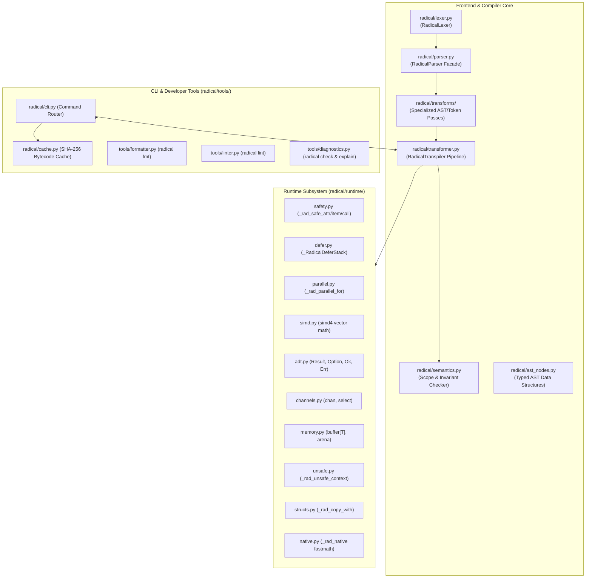

# Radical Compiler & Runtime Architecture

This document provides a comprehensive overview of the internal design, modular subsystem breakdown, and compilation pipeline of **Radical (`.rad`)**, a performance-oriented strict superset of Python 3.10+.

---

## 1. High-Level Subsystem Architecture

Radical's codebase is structured into strictly decoupled, single-responsibility modules:

---

## 2. Compilation Stages

The compilation of a `.rad` source file follows five deterministic stages:

### Stage 1: Lexical Analysis (`radical/lexer.py`)
- Custom multi-character operators are tokenized with source line/column coordinates:
  - Pipelines: `|>`
  - Safe navigation: `?.`, `?[]`, `?.()`
  - Nullish coalescing: `??`, `??=`
  - Ranges: `..`, `..=`
  - Arrow functions: `=>`
  - Question operator: `?`
- Radical-specific keywords are recognized: `const`, `let`, `struct`, `trait`, `enum`, `fn`, `native`, `using`, `defer`, `unsafe`, `parallel`, `gpu`, `raw`.

### Stage 2: Token Stream Transformation Passes (`radical/transforms/`)
The parser delegates syntactic lowering passes to focused transform modules:

1. **`radical/transforms/bindings.py`**:
   - `transform_let`: Converts mutable `let` declarations to Python bindings.
   - `transform_const`: Validates and extracts `const` variables for compile-time immutability enforcement.
   - `transform_destructuring`: Rewrites `{ a, b } = target` with dictionary and attribute guards.

2. **`radical/transforms/declarations.py`**:
   - `transform_structs`: Lowers `struct Name(...)` to `@dataclass(slots=True, frozen=True)`.
   - `transform_traits`: Lowers `trait Name:` to `@typing.runtime_checkable class ...(typing.Protocol)`.
   - `transform_enums`: Lowers `enum Name:` into sealed algebraic data type classes.
   - `transform_fn_functions`: Converts `fn` declarations to typed Python functions with return-type checking.
   - `transform_native_fn`: Validates strict typing contracts and applies `@_rad_native` Numba/LLVM decorators.
   - `transform_raw_buffers`: Lowers continuous `raw` ctypes arrays.

3. **`radical/transforms/control_flow.py`**:
   - `transform_using`: Lowers scoped `using res = expr:` to Python `with` context blocks.
   - `transform_unsafe`: Quarantines raw pointer operations inside depth-counted `_rad_unsafe_context()`.
   - `transform_defer`: Wraps functions containing `defer` with `_RadicalDeferStack()` in LIFO order.
   - `transform_select`: Lowers multi-channel `select:` blocks into non-blocking `try_recv()` branches.

4. **`radical/transforms/concurrency.py`**:
   - `transform_cartesian_loops`: Rewrites `for x, y in (A x B):` into C-accelerated `itertools.product(A, B)`.
   - `transform_parallel_loops`: Lowers `parallel for` and `parallel [...]` to multi-core worker pool dispatches.
   - `transform_gpu_constructs`: Lowers `gpu for` to Apple Silicon Metal compute kernels with CPU SIMD fallback.

5. **`radical/transforms/operators.py`**:
   - `transform_ranges`: Rewrites `start..end` and `start..=end..step` to `range(...)`.
   - `transform_coalescing`: Rewrites `??` and `??=` into null-strict ternary expressions with walrus assignment.
   - `transform_safe_nav`: Rewrites `?.`, `?[]`, and `?.()` to safe runtime accessors.
   - `transform_struct_with`: Rewrites `<expr> with { ... }` to functional copy-updates.
   - `transform_tagged_templates`: Lowers `tag"string"` to `tag(f"string")`.
   - `transform_try_operator`: Rewrites `expr?` into early error returns (`Result.Err` or `None`).

6. **`radical/transforms/functional.py`**:
   - `transform_arrows`: Rewrites arrow functions `(x) => expr` to `lambda x: expr`.
   - `transform_pipelines`: Lowers `data |> f` into `f(data)`.
   - **Pipeline Fusion**: Fuses chained `filter` and `map` operations terminating in collection constructors (`list`, `set`, `tuple`, `sum`) into optimized Python list comprehensions, inlining lambdas and eliminating heap iterator allocations.

7. **`radical/transforms/emitter.py`**:
   - `tokens_to_source`: Reconstructs clean Python source code from the transformed token stream, preserving exact indentation levels and whitespace.

### Stage 3: Header & Preamble Generation (`radical/transformer.py`)
- Analyzes emitted symbols and requirements.
- Automatically inserts only required standard library (`itertools`, `dataclasses`, `typing`, `ctypes`) and runtime imports (`radical.runtime`).

### Stage 4: Compile-Time Constant Folding (`radical/transforms/folding.py`)
- Parses emitted Python code into Python AST.
- Evaluates constant arithmetic (`+`, `-`, `*`, `/`, `//`, `%`, `**`), bitwise operations, boolean logic, and string concatenations at build time.

### Stage 5: Semantic Scope Validation (`radical/semantics.py`)
- Traverses AST symbol tables to enforce immutability:
  - Raises `RadicalCompileError` if any `const` binding is reassigned, mutated with augmented assignment (`+=`, etc.), or targeted by a loop variable.

---

## 3. Runtime Subsystem Architecture (`radical/runtime/`)

The runtime subsystem is fully modularized into isolated units under `radical/runtime/`:

| Module | Responsibility | Key Classes & Functions |
| :--- | :--- | :--- |
| **`safety.py`** | Safe null-aware attribute, item, and call accessors | `_rad_safe_attr`, `_rad_safe_item`, `_rad_safe_call`, `_rad_coalesce` |
| **`defer.py`** | Guaranteed LIFO resource management | `_RadicalDeferStack` |
| **`parallel.py`** | Multi-core CPU loop distribution bypassing the GIL | `_rad_parallel_for` |
| **`simd.py`** | 4-lane hardware vector arithmetic with unrolled operations | `simd4`, `simd` |
| **`adt.py`** | Rust-style algebraic data types for error handling | `Result`, `Ok`, `Err`, `Option`, `Some`, `Nil`, `None_` |
| **`channels.py`** | Thread-safe FIFO ring buffer with non-blocking multi-channel polling | `chan`, `Channel` |
| **`memory.py`** | Contiguous typed memory buffers & bump allocation arenas | `buffer`, `TypedBuffer`, `arena`, `Arena`, numeric primitive types (`f32`, `i32`, etc.) |
| **`unsafe.py`** | Thread-safe depth-counted boundary for unchecked pointer math | `_rad_unsafe_context` |
| **`structs.py`** | Non-destructive functional record copy-update | `_rad_copy_with` |
| **`native.py`** | JIT fastmath numerical compiler tier | `_rad_native` (Numba / LLVM integration) |

---

## 4. Tooling & Bytecode Caching (`radical/tools/`, `radical/cache.py`)

- **`radical/cache.py`**:
  - Computes SHA-256 hashes of source code concatenated with Python runtime version and Radical package version.
  - Caches compiled code objects in adjacent `__radcache__/*.pyc` files, eliminating repeat compilation overhead during `radical run`.
- **`radical/tools/formatter.py`**:
  - Implements canonical whitespace and line-ending formatting (`radical fmt [-w]`).
- **`radical/tools/linter.py`**:
  - Analyzes Radical source code for unsafe pointer escapes and safety invariants (`radical lint`).
- **`radical/tools/diagnostics.py`**:
  - Provides compiler optimization explanations (`radical explain [-v]`) and syntax verification (`radical check`).
